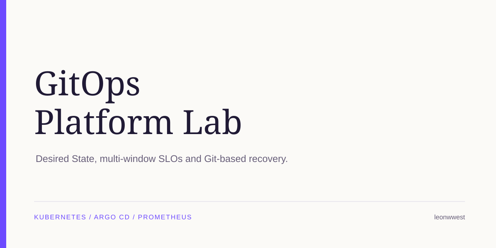
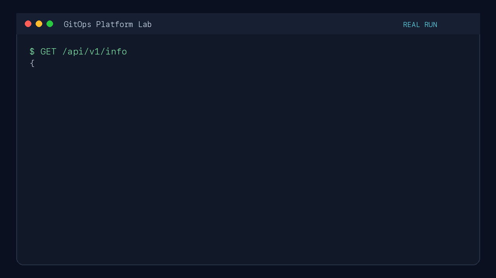
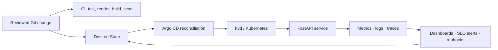

# GitOps Platform Lab

[](https://github.com/leonwwest/gitops-platform-lab/actions/workflows/verify.yml)
[](https://github.com/leonwwest/gitops-platform-lab/actions/workflows/security.yml)



A reproducible platform-engineering lab that takes a tested FastAPI service through container packaging, Kubernetes Desired State, Argo CD reconciliation, observability and incident recovery.

The workload stays deliberately small so the operating model remains inspectable: CI validates the candidate, Git records the desired state, and Argo CD is the deployment boundary.

## 60-second view

| Capability | Inspectable evidence |
|---|---|
| GitOps delivery | Least-privilege [Argo CD AppProject](gitops/platform-lab-project.yaml) plus an [Application](gitops/demo-service.yaml) with automated sync, pruning and self-healing |
| Verification | 21 HTTP, manifest and operational-contract tests; three Kustomize overlays; non-root container build |
| Workload policy | Enforced Kubernetes `restricted` Pod Security Standard plus tested `NetworkPolicy`, `PodDisruptionBudget`, `HorizontalPodAutoscaler`, probes, resources and security contexts |
| SLO operations | Tested 5m/1h [burn-rate rules](observability/slo-rules.yaml), a deterministic [breach/recovery exercise](docs/evidence/slo-burn-rate.md) and linked [operator runbook](docs/runbooks/slo-alerts.md) |
| Recovery | Guarded [drift/self-healing](docs/runbooks/reconciliation-exercise.md) and failure exercises plus a [Desired State rebuild](docs/runbooks/disaster-recovery.md) that never restores mutable snapshots |
| Supply chain | Read-only GitHub Actions, SHA-pinned actions, locked Python dependencies, CodeQL, dependency audit, Trivy and SPDX SBOM |

### Recorded execution

This recording shows the running service and the repository's complete `make verify` path. It is observed output from the lab, not a product mock-up.



## Operating model



CI has no application-deployment step. Promotion is a reviewed Desired State change, and Argo CD reconciles it into the cluster. The full rationale and data flow are in [Architecture](docs/architecture.md).

## What is implemented

- FastAPI health, readiness, metrics, structured JSON logging and OpenTelemetry tracing
- Multi-stage, non-root image with a runtime health check
- Kustomize base plus local, failure and production-like overlays
- Local k3d platform with Argo CD, Prometheus, Grafana, Loki, Alloy and Jaeger
- Reconciliation with automated sync, pruning and drift self-healing
- Reproducible reconciliation exercise that proves drift repair without a Git revision change
- Argo CD project boundaries for the allowed Git source, cluster destination and Kubernetes resource kinds
- Production-like availability and network-isolation contracts
- Namespace-level enforcement, audit and warnings for the Kubernetes `restricted` Pod Security Standard
- Guarded failure exercise with observable HTTP 503 behaviour and Git-based recovery
- Deterministic SLO exercise that breaches both burn-rate windows and then demonstrates recovery
- Rebuild evidence that records Git revision, Argo state and runtime state without restoring snapshots
- Current SHA-pinned GitHub Actions and a documented, pinned [tested toolchain](docs/tested-toolchain.md)

## Verify it

On macOS, install the documented prerequisites and start the container runtime:

```bash
brew install python@3.12 docker colima k3d kubectl helm argocd
colima start --cpu 4 --memory 8
```

Run the fast verification path:

```bash
make verify
make container-verify
make slo-exercise
```

Run the complete local platform:

```bash
make platform-up
```

This verifies the code and manifests, creates the cluster, imports the image, installs Argo CD and the observability stack, reconciles Git Desired State, and checks metrics, logs, traces and Grafana health.

For focused operations, use the linked guides:

- [Architecture and data flow](docs/architecture.md)
- [Failure Exercise runbook](docs/runbooks/failure-exercise.md)
- [Desired State reconciliation exercise](docs/runbooks/reconciliation-exercise.md)
- [SLO alert runbook](docs/runbooks/slo-alerts.md)
- [Desired State recovery exercise](docs/runbooks/disaster-recovery.md)
- [Interview cheat sheet](docs/interview-cheat-sheet.md)

## Repository map

```text
app/                    FastAPI Demo Service
tests/                  HTTP, manifest and operational-contract tests
deploy/base/            Reusable Kubernetes Desired State
deploy/overlays/        Local, failure and production-like variants
gitops/                 Argo CD AppProject and Application
observability/          Pinned values, SLO rules and Grafana dashboard
scripts/                Bootstrap, verification and recovery automation
docs/                   Architecture, ADR, runbooks and interview notes
```

## Verified evidence

The following flows were exercised locally on Apple Silicon on **24 July 2026**:

- `make verify`: 14 tests, Ruff lint and format checks, and all Kustomize overlays rendered
- `make container-verify`: image ran as UID 10001 and passed HTTP checks
- `make local-up`: Deployment reached `1/1` Available and passed runtime smoke tests
- Argo CD reached `Synced / Healthy` and restored manual replica drift from 2 to 1
- `make observability-verify`: Prometheus metric, unique Alloy/Loki log, Jaeger service and Grafana health confirmed
- Failure Exercise: controlled HTTP 503 observed, then healthy Git state reconciled and smoke-tested

## Scope boundary

This lab is intentionally optimized for repeatable execution on one laptop. It demonstrates platform interfaces and operational reasoning without claiming production-cluster operation.

The local profile uses k3d, ephemeral Prometheus/Grafana storage, Loki single-binary filesystem storage and Jaeger all-in-one. The production-like overlay is rendered and contract-tested rather than hosted publicly. A production implementation would extend the same boundaries with highly available persistent storage, encrypted backups and tested RPO/RTOs, external secrets and workload identity, enforced policy, signed artifacts, ingress TLS/SSO and controlled environment promotion.
