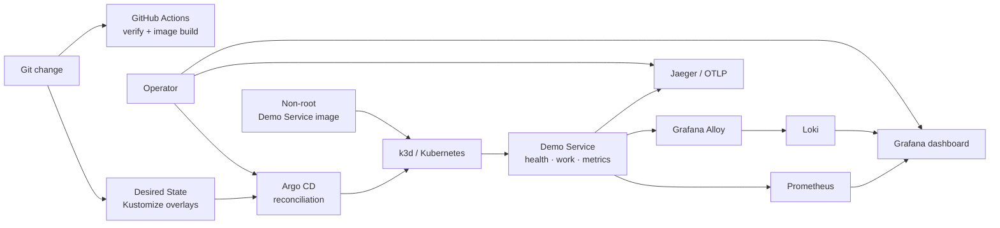

# GitOps Platform Lab

[](https://github.com/leonwwest/gitops-platform-lab/actions/workflows/verify.yml)

A hands-on portfolio and learning environment for the complete path from tested code to container, Kubernetes Desired State, Argo CD reconciliation, observability and incident recovery.

The workload is deliberately small. The value of the project is the **operating path around it**: repeatable verification, safe packaging, declarative delivery, Operational Signals and a reversible Failure Exercise.

## What this demonstrates

- FastAPI service with health, readiness, metrics, structured JSON logs and OpenTelemetry traces
- TDD through public HTTP and rendered-manifest seams
- Multi-stage, non-root container image with a runtime health check
- Kustomize base plus local, failure and production-like overlays
- Local Kubernetes with k3d and explicit probes, resources and security contexts
- Argo CD automated sync, pruning and self-healing from Git
- Prometheus, Grafana, Loki, Grafana Alloy and Jaeger with pinned Helm chart versions
- A guarded incident exercise and recovery by returning to Git Desired State
- GitHub Actions with read-only permissions and immutable action references

## Architecture



The important boundary is intentional: CI validates and builds, while Argo CD deploys by reconciling Git. See [Architecture](docs/architecture.md).

## Quick start

### Prerequisites on macOS

```bash
brew install docker colima k3d kubectl helm argocd
colima start --cpu 4 --memory 8
```

### 1. Verify code and manifests

```bash
make setup
make verify
make container-verify
```

### 2. Run directly on k3d

```bash
make local-up
curl http://127.0.0.1:8080/api/v1/info
```

### 3. Turn the cluster into a GitOps environment

```bash
make gitops-up
make gitops-status
```

Argo CD now reconciles `deploy/overlays/local` from this repository. A manual change to a managed Deployment is detected and corrected.

### 4. Install and verify observability

```bash
make observability-up
make observability-verify
```

The verification generates requests and proves all four paths:

- Prometheus returns `demo_http_requests_total`.
- Loki returns a unique structured log collected by Alloy.
- Jaeger lists `gitops-platform-lab-demo`.
- Grafana reports a healthy database and loads the provisioned dashboard.

### 5. Practise an incident

```bash
CONFIRM_FAILURE_EXERCISE=YES make failure-inject
make failure-status
make failure-recover
```

Follow the [Failure Exercise runbook](docs/runbooks/failure-exercise.md). The guard prevents accidental injection; recovery restores the version-controlled healthy state through Argo CD.

### Cleanup

```bash
make local-down
colima stop
```

## Local access

Run each port-forward in its own terminal:

```bash
kubectl port-forward -n argocd svc/argocd-server 8081:443
kubectl port-forward -n observability svc/grafana 3000:80
kubectl port-forward -n observability svc/prometheus-server 9090:80
kubectl port-forward -n observability svc/jaeger 16686:16686
```

- Demo Service: http://127.0.0.1:8080/docs
- Argo CD: https://127.0.0.1:8081
- Grafana: http://127.0.0.1:3000
- Prometheus: http://127.0.0.1:9090
- Jaeger: http://127.0.0.1:16686

Retrieve local credentials when needed:

```bash
make observability-password
kubectl -n argocd get secret argocd-initial-admin-secret \
  -o jsonpath='{.data.password}' | base64 --decode; echo
```

## Repository map

```text
app/                    Demo Service
tests/                  Public behaviour and declarative-contract tests
deploy/base/            Reusable Kubernetes Desired State
deploy/overlays/        Local, failure and production-like variants
gitops/                 Argo CD Application
observability/          Pinned values and Grafana dashboard
scripts/                Bootstrap, verification and runbook automation
docs/                   Architecture, ADRs and interview notes
```

## Verification evidence

Verified locally on **24 July 2026** on Apple Silicon:

- `make verify`: 19 behaviour and contract tests, Ruff lint and format, Kustomize render
- `make container-verify`: image ran as UID 10001 and passed HTTP checks
- `make local-up`: k3d Deployment became `1/1` Available and passed runtime smoke tests
- Argo CD: Application became `Synced / Healthy`; manual replica drift was restored from 2 to 1
- `make observability-verify`: metrics, a unique Alloy log, a Jaeger service and Grafana health all confirmed
- Failure Exercise: HTTP 503 observed, then healthy Git state reconciled and smoke-tested

The matching GitHub Issues contain per-slice completion notes.

## Production caveats

This is an honest learning environment, not a production platform:

- k3d is a local Kubernetes distribution; it does not prove experience operating a production cluster.
- Loki uses single-binary filesystem storage with a test schema; Prometheus and Grafana use ephemeral storage.
- Jaeger uses the chart's local all-in-one configuration.
- There is no external secret manager, ingress TLS, SSO, network isolation policy set, image signing or vulnerability gate.
- The production-like overlay is illustrative and is not deployed to a public environment.
- A real platform would add highly available storage, backups, SLOs and alerts, workload identity, policy enforcement, signed artifacts and environment-specific promotion.

These trade-offs keep the Platform Lab runnable on one laptop while preserving the important interfaces and operational reasoning.

## Learning notes

- [Architecture and data flow](docs/architecture.md)
- [Failure Exercise runbook](docs/runbooks/failure-exercise.md)
- [Interview cheat sheet](docs/interview-cheat-sheet.md)
- [Domain glossary](CONTEXT.md)

## Sources

- [Argo CD documentation](https://argo-cd.readthedocs.io/)
- [Kustomize documentation](https://kubectl.docs.kubernetes.io/guides/)
- [Prometheus documentation](https://prometheus.io/docs/)
- [Grafana Alloy Kubernetes log collection](https://grafana.com/docs/alloy/latest/reference/components/loki/loki.source.kubernetes/)
- [OpenTelemetry Python documentation](https://opentelemetry.io/docs/languages/python/)
